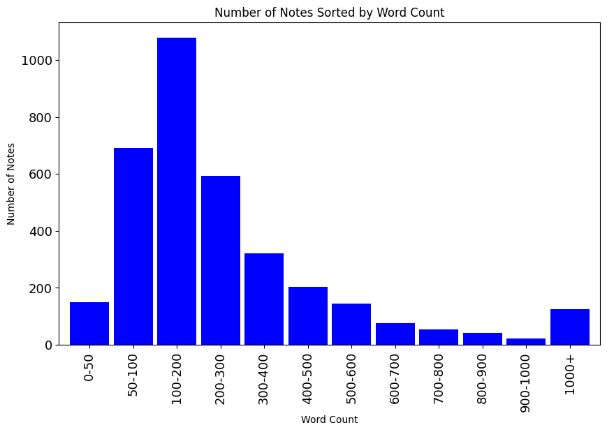

  
  
# Sorting notes by word count  
## ★ Installation
Open a terminal
`cd` to where you want the app to live.  

Clone repository
`git clone https://github.com/woodenzen/wc.git`  

Install Poetry if needed
`pip install poetry`  

Create virtual environment and load dependancies
`poetry install`  

## ★ Usage 
This is a Jupyter Notebook. Just open and select Run All.

### Sample Output

## ★ Licience
[MIT](./LICENSE.md)

## ★ Disclaimer
When it comes to Python, I am just a hobbyist. So it's very likely I made some mistakes. Please bear with me. Let me know and I'll fix things and in doing so, you'll be teaching me to be a better programmer.
